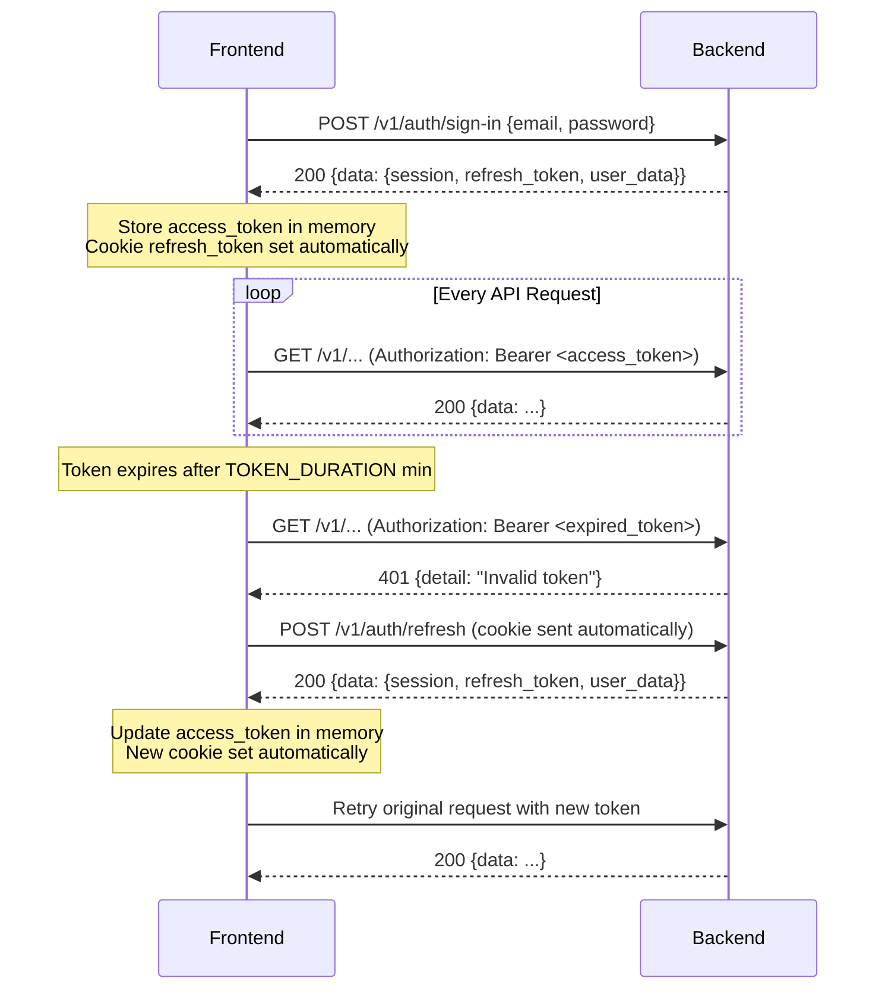
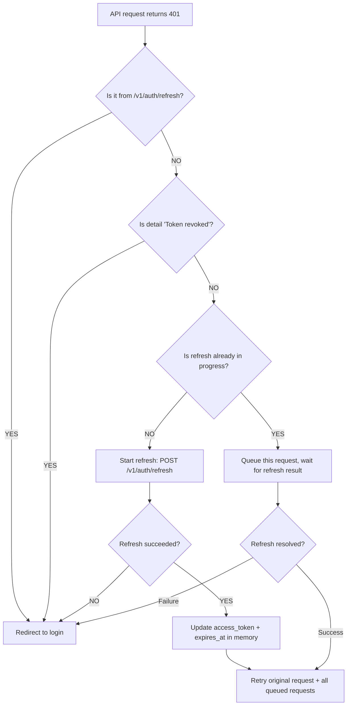
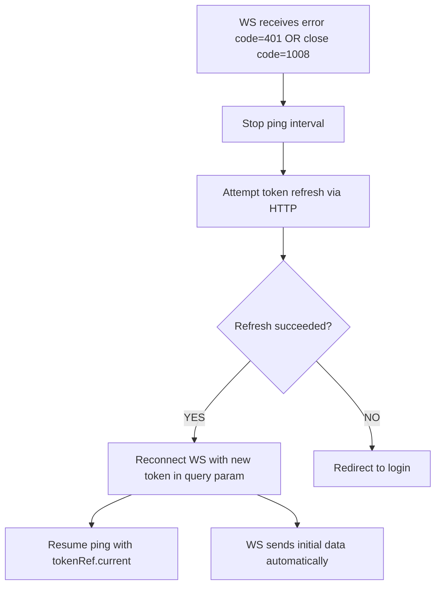

# GT360 Auth & Token Management - Frontend Implementation Guide

Complete backend reference for implementing token lifecycle management, session recovery, and authentication error handling in the frontend.

---

## 1. Token Architecture

### Token Pair

| Token | Type | Duration | Storage | Transport |
|-------|------|----------|---------|-----------|
| **Access Token** | JWT (HS256) | `TOKEN_DURATION` env var (minutes) | Client memory (never localStorage) | `Authorization: Bearer <token>` header |
| **Refresh Token** | Opaque (`secrets.token_urlsafe(64)`) | 30 days | HTTP-only cookie (auto-sent) + response body | Cookie auto-sent on same-domain requests |

### Authentication Flow Diagram



---

## 2. API Endpoints & Response Formats

### Sign-In (`POST /v1/auth/sign-in`)

**Request Body:**
```json
{
  "email": "user@example.com",
  "password": "MyP@ssw0rd"
}
```

**Response (200):**
```json
{
  "data": {
    "session": {
      "access_token": "eyJhbGciOiJIUzI1NiIs...",
      "expires_at": 1740000000,
      "type": "Bearer"
    },
    "refresh_token": {
      "refresh": "abc123...",
      "expires_at": "2026-03-25T15:30:00+00:00"
    },
    "user_data": {
      "id": "uuid-here",
      "email": "user@example.com",
      "phone": "+15551234567",
      "role": "manager",
      "first_name": "John",
      "last_name": "Doe",
      "profile_pic": "url-or-null",
      "organization_id": "org-uuid"
    }
  }
}
```

> **Note:** `session.expires_at` is a **Unix timestamp in seconds** (not milliseconds). Convert with `expires_at * 1000` for JavaScript `Date`.

**Cookies Set:**
- `refresh_token`: HTTP-only, Secure, SameSite=Lax, Domain=`.gt360.app`, Path=`/`, MaxAge=30 days
- `expires_at`: HTTP-only, Secure, SameSite=Lax, Domain=`.gt360.app`, Path=`/`, MaxAge=30 days

### Refresh (`POST /v1/auth/refresh`)

The refresh token can be sent via **cookie** (automatic) or **request body**:

```json
{
  "refresh_token": "abc123...",
  "refresh": "abc123...",
  "token": "abc123..."
}
```

Any of the three body fields is accepted. If none provided, the `refresh_token` cookie is used.

**Response (200):** Identical format to sign-in:
```json
{
  "data": {
    "session": {
      "access_token": "eyJhbGciOiJIUzI1NiIs...",
      "expires_at": 1740003600,
      "type": "Bearer"
    },
    "user_data": {
      "id": "uuid-here",
      "email": "user@example.com",
      "phone": "+15551234567",
      "role": "manager",
      "first_name": "John",
      "last_name": "Doe",
      "profile_pic": "url-or-null",
      "organization_id": "org-uuid"
    },
    "refresh_token": {
      "refresh": "new-token-abc...",
      "expires_at": "2026-03-25T15:30:00+00:00"
    }
  }
}
```

### Sign-Out (`POST /v1/auth/sign-out/`)

> **Note:** Trailing slash required in the path.

**Requires:** Valid Bearer token in Authorization header.

**Response (200):**
```json
{
  "message": "All cookies revoked"
}
```

**Effects:**
- Access token blacklisted in Redis for 5 minutes (300 seconds)
- ALL refresh tokens for the user revoked in database
- Cookies `refresh_token` and `expires_at` deleted

### Change Password (`PUT /v1/auth/change-password`)

**Requires:** Valid Bearer token + `user_id` query parameter.

**Request Body:**
```json
{
  "current_password": "OldP@ssw0rd",
  "new_password": "NewP@ssw0rd!"
}
```

**Response (200):**
```json
{
  "message": "Password reset successful. Please sign in again with your new password."
}
```

**Effects:**
- All refresh tokens revoked
- Cookies cleared
- User must sign in again

**Errors:**
| Status | `detail` | Cause |
|--------|----------|-------|
| 400 | `"The new password must be different from your current password."` | Same password |
| 403 | `"Incorrect current password"` | Wrong current password |
| 409 | `"The new password must be different from your current password."` | Same password (double-check) |

### Forgot Password (`POST /v1/auth/forgot-password`)

**Request Body:** Raw email string (not JSON object):
```json
"user@example.com"
```

**Response (200):**
```json
"If the email exists, you will receive a password reset link"
```

> Always returns the same message regardless of whether the email exists (security).

### Reset Password (`POST /v1/auth/reset-password`)

**Query Params:** `?token=<reset_token_from_email>`

**Request Body:**
```json
{
  "new_password": "NewP@ssw0rd!"
}
```

**Response (200):**
```json
{
  "message": "Password updated. Sign in again."
}
```

**Effects:**
- All refresh tokens revoked
- Nonce invalidated (one-time use)
- Cookies cleared

**Errors:**
| Status | `detail` | Cause |
|--------|----------|-------|
| 403 | `"Invalid or expired token"` | Token expired or invalid JWT |
| 400 | `"Invalid reset token"` | Token purpose is not "password_reset" |
| 404 | `"User not found"` | User no longer exists |
| 400 | `"Token already used or invalid"` | Nonce already consumed |
| 409 | `"The new password must be different from your current password."` | Same password |

### Verify Email (`GET /v1/auth/verify-email`)

**Query Params:** `?token=<verification_token_from_email>`

**Response (200):**
```json
"Email verified successfully"
```

**Errors:**
| Status | `detail` | Cause |
|--------|----------|-------|
| 304 | `"Email already verified"` | Already verified |
| 400 | `"Token already used or invalid"` | Nonce consumed |
| 400 | `"Invalid or expired token: ..."` | Catch-all for bad tokens |
| 404 | `"User not found"` | User doesn't exist |

### Verify Data (`POST /v1/auth/verify-data`)

Pre-registration validation (check email/phone availability).

**Request Body:**
```json
{
  "email": "user@example.com",
  "phone": "+15551234567"
}
```

**Response (200):**
```json
{
  "message": "Ok"
}
```

**Errors:**
| Status | `detail` | Cause |
|--------|----------|-------|
| 409 | `"Email already in use"` | Email taken |
| 409 | `"Phone already in use"` | Phone taken |

### Roles in `user_data`

| Role | Extra fields in `user_data` |
|------|----------------------------|
| `manager` | `organization_id` |
| `driver` | `organization_id`, `location_id` |

---

## 3. Auth Error Catalog

### HTTP Errors from Protected Endpoints (middleware)

These are returned by the `VerifyToken` middleware when accessing any protected endpoint:

| Status | `detail` value | Cause | Frontend Action |
|--------|---------------|-------|-----------------|
| **401** | `"Missing authentication token"` | No `Authorization` header or empty Bearer | **Silent refresh** |
| **401** | `"Invalid token"` | JWT expired, malformed, or bad signature | **Silent refresh** |
| **401** | `"Token revoked"` | Token blacklisted after sign-out | **Redirect to login** (do NOT refresh) |

### HTTP Errors from Refresh Endpoint (`POST /v1/auth/refresh`)

| Status | `detail` value | Cause | Frontend Action |
|--------|---------------|-------|-----------------|
| **401** | `"Missing refresh token"` | No cookie and no body field | **Redirect to login** |
| **401** | `"Invalid refresh token"` | Token hash not found in DB | **Redirect to login** |
| **401** | `"Refresh token expired or revoked"` | Token revoked flag is true | **Redirect to login** |
| **401** | `"Expired refresh"` | Token expired (>30 days) | **Redirect to login** |

### Authorization Errors (role-based)

| Status | `detail` value | Cause | Frontend Action |
|--------|---------------|-------|-----------------|
| **403** | `"Not Authorized: We couldn't validate the role"` | User role not allowed for endpoint | **Show permission error** (no refresh/redirect) |
| **401** | `"Missing or invalid authentication"` | No user data in request state | **Silent refresh** |

### Other Auth Errors

| Status | `detail` value | Cause |
|--------|---------------|-------|
| **401** | `"Invalid credentials"` | Wrong email/password on sign-in |
| **401** | `"Email not verified"` | User hasn't verified email |
| **403** | `"Email not allowed for manager registration"` | Beta: email not in whitelist |
| **409** | `"Email already in use"` | Registration with existing email |
| **409** | `"Organization name already exist"` | Duplicate org name on registration |
| **429** | `"Too many requests. Try again later."` | Rate limit exceeded (1000 req/hour per IP+method+path) |

> **Rate limit 429 response** includes a `retry_after` field (seconds) and a `Retry-After` header.

### Decision Rule

```
Is it a 401 from /v1/auth/refresh?
  YES -> Session is dead -> Redirect to login

Is the detail "Token revoked"?
  YES -> User signed out -> Redirect to login immediately

Is it a 403?
  YES -> Permission error -> Show error message, do NOT refresh

Is it any other 401?
  YES -> Token expired -> Attempt silent refresh
```

---

## 4. Silent Refresh Flow

### Decision Flowchart



### TypeScript Implementation Pattern (Axios)

```typescript
// auth-interceptor.ts
import axios, { AxiosError, InternalAxiosRequestConfig } from 'axios';

const api = axios.create({
  baseURL: process.env.NEXT_PUBLIC_API_URL,
  withCredentials: true, // CRITICAL: sends cookies with every request
});

// --- State ---
let accessToken: string | null = null;
let expiresAt: number | null = null; // Unix timestamp in SECONDS
let isRefreshing = false;
let failedQueue: Array<{
  resolve: (token: string) => void;
  reject: (error: unknown) => void;
}> = [];

// --- Helpers ---
function setTokens(session: { access_token: string; expires_at: number }) {
  accessToken = session.access_token;
  expiresAt = session.expires_at;
}

function clearAuth() {
  accessToken = null;
  expiresAt = null;
}

function redirectToLogin() {
  clearAuth();
  // Save current URL for post-login redirect
  sessionStorage.setItem('redirectAfterLogin', window.location.pathname + window.location.search);
  window.location.href = '/login';
}

function processQueue(error: unknown, token: string | null) {
  failedQueue.forEach(({ resolve, reject }) => {
    if (token) resolve(token);
    else reject(error);
  });
  failedQueue = [];
}

// --- Request Interceptor ---
api.interceptors.request.use((config: InternalAxiosRequestConfig) => {
  if (accessToken) {
    config.headers.Authorization = `Bearer ${accessToken}`;
  }
  return config;
});

// --- Response Interceptor ---
api.interceptors.response.use(
  (response) => response,
  async (error: AxiosError<{ detail: string }>) => {
    const originalRequest = error.config as InternalAxiosRequestConfig & { _retry?: boolean };
    const status = error.response?.status;
    const detail = error.response?.data?.detail;

    // Only handle 401s (not 403s, not other errors)
    if (status !== 401 || originalRequest._retry) {
      return Promise.reject(error);
    }

    // If token was explicitly revoked (user signed out elsewhere), go to login
    if (detail === 'Token revoked') {
      redirectToLogin();
      return Promise.reject(error);
    }

    // If this 401 came from the refresh endpoint itself, session is dead
    if (originalRequest.url?.includes('/v1/auth/refresh')) {
      redirectToLogin();
      return Promise.reject(error);
    }

    // If a refresh is already in progress, queue this request
    if (isRefreshing) {
      return new Promise((resolve, reject) => {
        failedQueue.push({
          resolve: (token: string) => {
            originalRequest.headers.Authorization = `Bearer ${token}`;
            originalRequest._retry = true;
            resolve(api(originalRequest));
          },
          reject,
        });
      });
    }

    // Start refresh
    isRefreshing = true;
    originalRequest._retry = true;

    try {
      // Cookie is sent automatically due to withCredentials: true
      const { data } = await api.post('/v1/auth/refresh');
      const newToken = data.data.session.access_token;

      setTokens(data.data.session);
      processQueue(null, newToken);

      // Retry the original request
      originalRequest.headers.Authorization = `Bearer ${newToken}`;
      return api(originalRequest);
    } catch (refreshError) {
      processQueue(refreshError, null);
      redirectToLogin();
      return Promise.reject(refreshError);
    } finally {
      isRefreshing = false;
    }
  }
);

export { api, setTokens, clearAuth, redirectToLogin };
```

### Sign-In Integration

```typescript
async function signIn(email: string, password: string) {
  const { data } = await api.post('/v1/auth/sign-in', { email, password });

  setTokens(data.data.session);
  // user_data available at data.data.user_data
  // refresh_token cookie set automatically by the browser

  // Check for saved redirect
  const redirect = sessionStorage.getItem('redirectAfterLogin');
  if (redirect) {
    sessionStorage.removeItem('redirectAfterLogin');
    window.location.href = redirect;
  }

  return data.data;
}
```

### Sign-Out Integration

```typescript
async function signOut() {
  try {
    await api.post('/v1/auth/sign-out/'); // trailing slash required
  } finally {
    clearAuth();
    // Close all WebSocket connections
    closeAllWebSockets();
    window.location.href = '/login';
  }
}
```

---

## 5. Proactive Token Refresh

Refresh the token BEFORE it expires so users never see a 401.

### Implementation

```typescript
let refreshTimer: ReturnType<typeof setTimeout> | null = null;

function scheduleProactiveRefresh(expiresAtSeconds: number) {
  // Clear any existing timer
  if (refreshTimer) clearTimeout(refreshTimer);

  // Calculate time until 5 minutes before expiry
  const now = Date.now();
  const expiresAtMs = expiresAtSeconds * 1000;
  const refreshAtMs = expiresAtMs - (5 * 60 * 1000); // 5 min before expiry
  const delay = refreshAtMs - now;

  if (delay <= 0) {
    // Token already expired or about to expire, refresh immediately
    silentRefresh();
    return;
  }

  refreshTimer = setTimeout(silentRefresh, delay);
}

async function silentRefresh() {
  try {
    const { data } = await api.post('/v1/auth/refresh');
    setTokens(data.data.session);
    scheduleProactiveRefresh(data.data.session.expires_at);
  } catch {
    // Refresh failed - will be caught by interceptor on next API call
  }
}

// Handle tab visibility changes
document.addEventListener('visibilitychange', () => {
  if (document.visibilityState === 'visible' && expiresAt) {
    const now = Date.now();
    const expiresAtMs = expiresAt * 1000;
    const timeLeft = expiresAtMs - now;

    if (timeLeft <= 0) {
      // Token expired while tab was in background
      silentRefresh();
    } else if (timeLeft <= 5 * 60 * 1000) {
      // Less than 5 min left, refresh now
      silentRefresh();
    }
    // Otherwise, timer is still running
  }
});
```

### When to Schedule

Call `scheduleProactiveRefresh(session.expires_at)` after:
- Successful sign-in
- Successful token refresh (reactive or proactive)

---

## 6. WebSocket Auth & Reconnection

### Six WebSocket Connections

| Endpoint | Query Params | Purpose |
|----------|-------------|---------|
| `ws/trips` | `location_id`, `token` | Real-time trip updates per location |
| `ws/flights/push` | `location_id`, `flight_numbers`, `token` | Flight status push notifications |
| `ws/flights/tracking` | `token` | Live flight position tracking (ADSB) |
| `ws/org` | `organization_id`, `token` | Organization-level events (billing, location deletions) |
| `ws/driver-locations` | `token`, `location_id` (optional, manager only) | Driver location sharing |
| `ws/profile` | `token` | Real-time user profile updates |

### Authentication Pattern (identical for all)

1. **Connect:** Token passed as query parameter (NOT header - WebSocket limitation)
2. **On connect:** Backend validates JWT. If invalid -> close code `1008` immediately
3. **Keep-alive ping:** Client sends `{"action": "ping", "token": "<current_token>"}` every 30 seconds
4. **Ping response:**
   - Valid token: `{"type": "pong"}`
   - Invalid/expired: `{"type": "error", "code": 401, "detail": "Invalid or expired token"}` -> then close `1008`

### On Successful Connection

Each WebSocket sends different initial messages:

| WebSocket | Initial Message |
|-----------|----------------|
| **Trips** | `{"type": "snapshot", "location_id": "...", "location_info": {...}, "trips": [...]}` |
| **Flight Push** | `{"type": "connected", "location_id": "...", "location_iata": "...", "flight_numbers": [...]}` + `{"type": "snapshot", "notifications": [...], "count": N}` |
| **Flight Tracking** | `{"type": "connected"}` (then requires `track` action to start receiving data) |
| **Org** | `{"type": "connected", "organization_id": "...", "message": "Connected to organization events"}` |
| **Driver Locations** (manager) | `{"type": "snapshot", "drivers": [...]}` |
| **Driver Locations** (driver) | `{"type": "driver_snapshot", "drivers": [...]}` (other drivers at same location, if sharing enabled) |
| **Profile** | `{"type": "snapshot", "data": {profile_fields...}}` |

### WebSocket Client Actions

#### Trips WS
- `{"action": "ping", "token": "..."}` - keep-alive
- `{"action": "subscribe"}` - subscribe confirmation
- `{"action": "unsubscribe"}` - unsubscribe from location

#### Flight Push WS
- `{"action": "ping", "token": "..."}` - keep-alive
- `{"action": "subscribe", "flight_number": "WN1036"}` - add flight
- `{"action": "unsubscribe", "flight_number": "WN1036"}` - remove flight

#### Flight Tracking WS
- `{"action": "ping", "token": "..."}` - keep-alive
- `{"action": "track", "flight_number": "WN1036", "trip_id": "uuid", "origin_icao": "KSDF", "destination_icao": "KLAS"}` - start tracking (`origin_icao` and `destination_icao` are optional)
- `{"action": "stop", "flight_number": "WN1036", "trip_id": "uuid"}` - stop tracking

#### Org WS
- `{"action": "ping", "token": "..."}` - keep-alive only (receives events passively)

#### Driver Locations WS (driver role)
- `{"action": "ping", "token": "..."}` - keep-alive
- `{"action": "location_update", "lat": 38.174, "lng": -85.736}` - send location

#### Driver Locations WS (manager role)
- `{"action": "ping", "token": "..."}` - keep-alive only (receives driver updates passively)

#### Profile WS
- `{"action": "ping", "token": "..."}` - keep-alive
- `{"action": "refresh"}` - request fresh profile snapshot

### Token Ref Pattern (Critical)

The ping interval must always use the LATEST access token, even after a refresh:

```typescript
const tokenRef = useRef(accessToken);

// Update ref whenever token changes
useEffect(() => {
  tokenRef.current = accessToken;
}, [accessToken]);

// Ping interval uses the ref, not a stale closure
useEffect(() => {
  const interval = setInterval(() => {
    if (ws.current?.readyState === WebSocket.OPEN) {
      ws.current.send(JSON.stringify({
        action: 'ping',
        token: tokenRef.current, // Always the latest token
      }));
    }
  }, 30_000);

  return () => clearInterval(interval);
}, []);
```

### Reconnection Strategy



### Reconnection with Exponential Backoff

```typescript
const BACKOFF = [1000, 2000, 5000, 10000, 30000]; // ms
let reconnectAttempt = 0;

function reconnectWebSocket() {
  const delay = BACKOFF[Math.min(reconnectAttempt, BACKOFF.length - 1)];
  reconnectAttempt++;

  setTimeout(() => {
    connectWebSocket(tokenRef.current);
  }, delay);
}

// Reset on successful connection
function onWebSocketOpen() {
  reconnectAttempt = 0;
}

// Do NOT reconnect on intentional close (code 1000)
function onWebSocketClose(event: CloseEvent) {
  if (event.code === 1000) return; // Intentional close
  if (event.code === 1008) {
    // Auth failure - try refresh first
    silentRefresh()
      .then(() => reconnectWebSocket())
      .catch(() => redirectToLogin());
  } else {
    // Other error - reconnect with backoff
    reconnectWebSocket();
  }
}
```

### Post-Reconnection State Recovery

| WebSocket | What happens on reconnect |
|-----------|--------------------------|
| **Trips** | Automatic snapshot with all current trips - no manual re-subscription needed |
| **Flight Push** | Automatic connected + snapshot of recent notifications |
| **Flight Tracking** | Must re-send `{"action": "track", ...}` for each tracked flight |
| **Org** | Automatic connected confirmation, events resume |
| **Driver Locations** | Automatic snapshot of driver positions |
| **Profile** | Automatic snapshot of profile data |

---

## 7. Login Redirect Flow

### When to Redirect

| Condition | Redirect? |
|-----------|-----------|
| Refresh endpoint returns 401 (any detail) | YES |
| Refresh endpoint network error (after 1 retry) | YES |
| Protected endpoint returns 401 with `"Token revoked"` | YES (skip refresh) |
| Protected endpoint returns 401 (other details) | NO - try refresh first |
| Any endpoint returns 403 | NO - show permission error |

### Pre-Redirect Cleanup

```typescript
function redirectToLogin() {
  // 1. Save current URL for post-login redirect
  sessionStorage.setItem('redirectAfterLogin',
    window.location.pathname + window.location.search
  );

  // 2. Clear auth state
  clearAuth();

  // 3. Clear proactive refresh timer
  if (refreshTimer) clearTimeout(refreshTimer);

  // 4. Close all WebSocket connections (code 1000 = intentional)
  closeAllWebSockets(1000);

  // 5. Redirect
  window.location.href = '/login';
}
```

### Post-Login Restoration

```typescript
async function onSignInSuccess(data: SignInResponse) {
  setTokens(data.session);
  scheduleProactiveRefresh(data.session.expires_at);

  // Reconnect all active WebSocket connections
  reconnectAllWebSockets(data.session.access_token);

  // Redirect to saved URL or default
  const savedUrl = sessionStorage.getItem('redirectAfterLogin');
  if (savedUrl) {
    sessionStorage.removeItem('redirectAfterLogin');
    router.push(savedUrl);
  } else {
    router.push('/dashboard');
  }
}
```

---

## 8. Session State Recovery (No Data Loss)

### What persists server-side (NOT lost on token expiration)

| Data | Storage | Retrieval after re-auth |
|------|---------|------------------------|
| **Filter Steps** | PostgreSQL (`trips.filter_steps`) | `GET /v2/locations/{id}/airlines/{airline}/filters/stack?pick_up_date=YYYY-MM-DD` |
| **Filter Presets** | PostgreSQL (`trips.filter_presets`) | `GET /v2/locations/{id}/airlines/{airline}/filters/preset` |
| **Trip Data** | PostgreSQL + Redis cache | WebSocket snapshot on reconnect, or `GET /v1/locations/{id}/trips` |
| **User Settings** | PostgreSQL (`settings.user_settings`) | `GET /v1/profile/settings` |
| **Organization Data** | PostgreSQL | Included in `user_data` on sign-in/refresh |

### What IS lost (client-side only)

- Unsaved form inputs
- In-flight optimistic UI updates
- Local UI state (selected tabs, scroll position, etc.)

With the silent refresh pattern implemented correctly, even these should rarely be lost since the request just retries transparently.

### Filter Rehydration Example

After re-authentication, the frontend can fully restore filter state:

```typescript
// 1. Get current filter stack for a specific day
const stack = await api.get(
  `/v2/locations/${locationId}/airlines/${airline}/filters/stack`,
  { params: { pick_up_date: '2026-02-19' } }
);

// 2. Get the preset (auto-apply template) if it exists
const preset = await api.get(
  `/v2/locations/${locationId}/airlines/${airline}/filters/preset`
);

// Both endpoints return the full current state - no data is lost
```

---

## 9. Multi-Tab Coordination

### Problem

If the user has multiple tabs open:
- Tab A refreshes the token -> Tab B still has the old access token
- Tab A signs out -> Tab B doesn't know and keeps making requests

### Solution: localStorage Event Sync

```typescript
const TOKEN_STORAGE_KEY = 'gt360_token_sync';
const SIGNOUT_KEY = 'gt360_signout';

// --- After refresh or sign-in, notify other tabs ---
function broadcastTokenUpdate(accessToken: string, expiresAt: number) {
  localStorage.setItem(TOKEN_STORAGE_KEY, JSON.stringify({
    accessToken,
    expiresAt,
    timestamp: Date.now(),
  }));
}

// --- After sign-out, notify other tabs ---
function broadcastSignOut() {
  localStorage.setItem(SIGNOUT_KEY, Date.now().toString());
}

// --- Listen for updates from other tabs ---
window.addEventListener('storage', (event) => {
  if (event.key === TOKEN_STORAGE_KEY && event.newValue) {
    const { accessToken: newToken, expiresAt: newExp } = JSON.parse(event.newValue);
    setTokens({ access_token: newToken, expires_at: newExp });
    scheduleProactiveRefresh(newExp);
    // Update WebSocket tokenRef
    tokenRef.current = newToken;
  }

  if (event.key === SIGNOUT_KEY) {
    // Another tab signed out - the backend revokes ALL refresh tokens,
    // so this tab's refresh will fail anyway
    redirectToLogin();
  }
});
```

> **Backend behavior on sign-out:** The backend calls `revoke_all_user_refresh()` which revokes ALL refresh tokens for the user across all sessions. This means if one tab signs out, all other tabs will fail their next refresh attempt.

---

## 10. Public Paths (No Auth Required)

These endpoints do NOT require authentication (the middleware skips them via prefix matching):

```
/v1/auth/register          (includes /register/manager and /register/driver)
/v1/auth/sign-in
/v1/auth/refresh
/v1/auth/verify-email
/v1/auth/verify-data
/v1/auth/forgot-password
/v1/auth/reset-password
/v1/auth/register/organization
/v1/webhooks/trips
/v1/webhooks/flights
/v1/webhooks/stripe
/v1/crew-lookup/config
/v1/crew-lookup/health
/v1/trips/search/qr
/v1/support/contact
/docs
/redoc
/openapi.json
/favicon.ico
/health
/ready
/uploads
```

The frontend should NOT attach `Authorization` headers or trigger refresh logic for these endpoints.

---

## 11. CORS Configuration

### Allowed Origins (CORSMiddleware)

```
https://www.gt360.com
https://dev.gt360.app
https://gt360.app
https://charmaine-leadless-ryleigh.ngrok-free.dev
```

### Allowed Origins (Error Handlers)

The HTTP exception handler also allows `https://web.gt360.app` and `http://192.168.1.101:3000/` for CORS on error responses.

### Cookie Domain

Cookies are set with `domain=".gt360.app"` which means they are sent to all subdomains: `dev.gt360.app`, `web.gt360.app`, etc.

### Critical Axios Setting

```typescript
const api = axios.create({
  baseURL: process.env.NEXT_PUBLIC_API_URL,
  withCredentials: true, // REQUIRED: sends cookies cross-origin
});
```

Without `withCredentials: true`, the browser will NOT send the `refresh_token` cookie, and the refresh endpoint will return 401 `"Missing refresh token"`.

---

## 12. Password Requirements

All password fields (`password`, `new_password`) must meet:

- Minimum 8 characters
- At least 1 uppercase letter (A-Z)
- At least 1 lowercase letter (a-z)
- At least 1 digit (0-9)
- At least 1 special character from: `` !@#$%^&*()_=+[]{};:,.<>?/\|~`'"- ``

Validation errors return **422** with Pydantic validation detail.

---

## 13. Testing Checklist

1. **Normal token expiry**: Wait for `TOKEN_DURATION` to elapse (or set it short in backend) -> verify silent refresh works, no visible error
2. **Refresh token expiry**: Revoke all refresh tokens in DB -> verify redirect to login
3. **Sign-out on another tab**: Sign out in Tab A -> verify Tab B redirects to login
4. **Network interruption during refresh**: Disconnect network briefly during refresh -> verify retry, then redirect
5. **WebSocket close 1008**: Let access token expire -> verify WS reconnects with new token after refresh
6. **WebSocket ping with expired token**: Verify error response -> reconnect flow
7. **Multiple concurrent 401s**: Fire 5+ API calls simultaneously with expired token -> verify only ONE refresh call, all requests retry
8. **Tab backgrounded**: Background tab, wait past expiry, foreground -> verify `visibilitychange` triggers refresh
9. **POST/PUT in-flight**: Start a mutation, let token expire during -> verify it completes after refresh
10. **403 role error**: Access manager endpoint as driver -> verify NO redirect, shows permission error
11. **Filters persist**: Apply filters -> let token expire -> re-auth -> verify filters still present via GET stack
12. **Post-login redirect**: Navigate to `/dashboard/locations/SDF/WN` -> token expires -> login -> verify redirect back to same page
13. **Flight tracking reconnect**: Track a flight -> reconnect WS -> verify must re-send `track` action
14. **Org WS billing events**: Simulate payment failure -> verify billing event received via org WS
15. **Driver locations WS**: Connect as driver -> send location_update -> verify manager receives it

---

## 14. JWT Payload Reference

For debugging, the access token JWT payload contains:

```json
{
  "sub": "user-uuid",
  "iat": 1740000000,
  "exp": 1740003600,
  "metadata": {
    "email": "user@example.com",
    "phone": "+15551234567",
    "role": "manager",
    "first_name": "John",
    "last_name": "Doe",
    "profile_pic": "url-or-null",
    "organization_id": "org-uuid",
    "location_id": "loc-uuid"
  }
}
```

> **Note:** `location_id` is only present for `driver` role. `organization_id` is present for both `manager` and `driver`.

> **Warning:** Never decode the JWT on the client for auth decisions. Always rely on the `expires_at` field from the API response for expiration timing.
