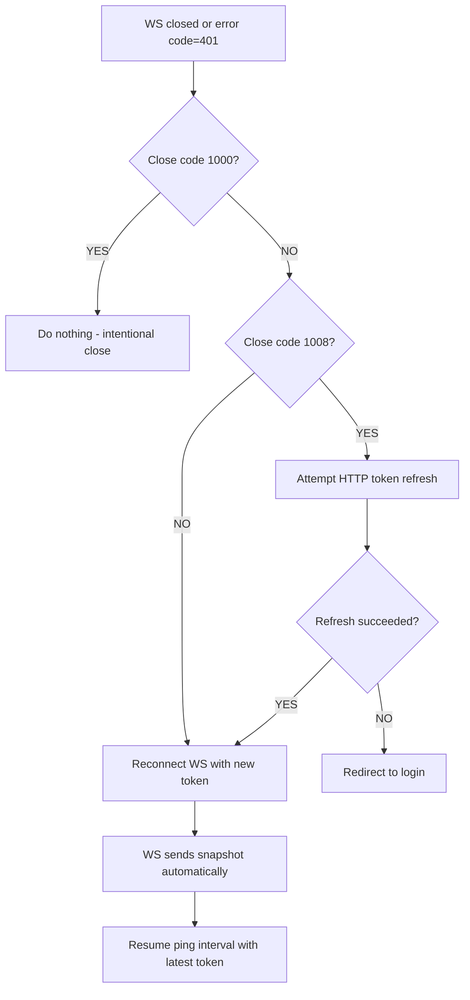

# GT360 WebSocket - Frontend Implementation Guide

Complete backend reference for implementing all WebSocket connections, message handling, authentication, and reconnection strategies.

---

## Table of Contents

1. [Overview & Connection Map](#1-overview--connection-map)
2. [Authentication (all WebSockets)](#2-authentication-all-websockets)
3. [ws/trips — Trip Updates](#3-wstrips--trip-updates)
4. [ws/org — Organization Events](#4-wsorg--organization-events)
5. [ws/flights/push — Flight Status Notifications](#5-wsflightspush--flight-status-notifications)
6. [ws/flights/tracking — Live Flight Position](#6-wsflightstracking--live-flight-position)
7. [ws/driver-locations — Driver Location Sharing](#7-wsdriver-locations--driver-location-sharing)
8. [ws/profile — Profile Updates](#8-wsprofile--profile-updates)
9. [Ground Filters — Step/Stack System & WebSocket Events](#9-ground-filters--stepstack-system--websocket-events)
10. [Reconnection Strategy (all WebSockets)](#10-reconnection-strategy-all-websockets)
11. [Redis Pub/Sub Channel Map](#11-redis-pubsub-channel-map)
12. [Quick Reference: All Message Types](#12-quick-reference-all-message-types)

---

## 1. Overview & Connection Map

| # | Endpoint | Query Params | Who Connects | Purpose |
|---|----------|-------------|--------------|---------|
| 1 | `ws/trips` | `location_id`, `token` | Manager | Real-time trip updates for a location |
| 2 | `ws/org` | `organization_id`, `token` | Manager | Org-level events (billing, location deletion, batch uploads) |
| 3 | `ws/flights/push` | `location_id`, `flight_numbers`, `token` | Manager | Flight status change notifications |
| 4 | `ws/flights/tracking` | `token` | Manager | Live aircraft position tracking (ADSB) |
| 5 | `ws/driver-locations` | `token`, `location_id?` | Manager or Driver | Driver GPS location sharing |
| 6 | `ws/profile` | `token` | Any authenticated user | Real-time profile data updates |

### Typical Manager Dashboard Connections

A manager viewing a location dashboard would open:

```
ws/trips?location_id=X&token=T          (trip stream for this location)
ws/org?organization_id=Y&token=T        (billing alerts, location deletions)
ws/flights/push?location_id=X&flight_numbers=WN1036,AA123&token=T  (flight notifications)
ws/driver-locations?token=T&location_id=X  (driver positions on map)
```

And optionally:
```
ws/flights/tracking?token=T             (opened when user clicks "track flight")
ws/profile?token=T                      (if profile sidebar is visible)
```

---

## 2. Authentication (all WebSockets)

### Connection Auth

All WebSockets authenticate via JWT passed as a **query parameter** (not header — WebSocket limitation):

```
wss://api.gt360.app/ws/trips?location_id=XXX&token=eyJhbGci...
```

**On connect:**
1. Backend decodes JWT
2. Extracts `metadata` from payload (role, org_id, etc.)
3. If invalid/expired -> closes immediately with code `1008`

### Keep-Alive Ping (every 30 seconds)

**All WebSockets** require periodic pings with a **fresh token** to stay alive:

```json
// Client sends:
{"action": "ping", "token": "eyJhbGci...CURRENT_TOKEN"}

// Server responds:
{"type": "pong"}

// If token expired:
{"type": "error", "code": 401, "detail": "Invalid or expired token"}
// -> then server closes with code 1008
```

### Token Ref Pattern (Critical for React)

The ping must always use the **latest** access token. After a silent refresh, stale closures will send the old token:

```typescript
const tokenRef = useRef(accessToken);

useEffect(() => {
  tokenRef.current = accessToken;
}, [accessToken]);

useEffect(() => {
  const interval = setInterval(() => {
    if (ws.current?.readyState === WebSocket.OPEN) {
      ws.current.send(JSON.stringify({
        action: 'ping',
        token: tokenRef.current, // Always latest
      }));
    }
  }, 30_000);
  return () => clearInterval(interval);
}, []);
```

---

## 3. ws/trips — Trip Updates

### Connection

```
wss://api.gt360.app/ws/trips?location_id={uuid}&token={jwt}
```

**Validation:** Backend checks that the user's `organization_id` owns the requested `location_id`. Closes `1008` if mismatch.

### Automatic Snapshot on Connect

Immediately after connection, the server sends all trips for this location:

```json
{
  "type": "snapshot",
  "location_id": "uuid",
  "location_info": {
    "id": "uuid",
    "name": "SDF",
    "timezone": "America/New_York"
  },
  "trips": [
    {
      "id": "trip-uuid",
      "location_id": "loc-uuid",
      "pick_up_date": "2026-02-23",
      "pick_up_time": "2026-02-23T14:30:00-05:00",
      "pick_up_location": "Hilton Garden Inn",
      "drop_off_location": "SDF",
      "airline": "WN",
      "flight_number": "WN1036",
      "riders": 2,
      "trip_type": "outbound",
      "status": "scheduled",
      "assigned_driver": null,
      "trip_hash": "abc123...",
      "started_at": null,
      "picked_up_at": null,
      "arrived_pickup_at": null,
      "arrived_dropoff_at": null,
      "dropped_off_at": null
    }
  ]
}
```

> **No `subscribe` needed.** Snapshot is sent automatically. The `subscribe` action only returns a confirmation — it does NOT trigger the snapshot.

### Live Events (after snapshot)

#### `trips_batch` — Batch trip updates (from webhook)

When trips arrive via external webhook (`/v1/webhooks/trips/batch`):

```json
{
  "type": "trips_batch",
  "location_id": "uuid",
  "events": [
    {
      "trip_id": "uuid",
      "event_type": "db_update",
      "location_id": "uuid",
      "trip": { ...full trip object... }
    },
    {
      "trip_id": "uuid-2",
      "event_type": "delete",
      "location_id": "uuid",
      "trip": { ...trip data before deletion... }
    }
  ]
}
```

**`event_type` values from webhook:**

| `event_type` | Meaning | Frontend Action |
|-------------|---------|-----------------|
| `db_update` | Default — trip created or updated (caller didn't specify) | **Upsert**: if exists update, if not add |
| `insert` | Explicitly new trip | Add to list |
| `update` | Explicitly updated trip | Update in list |
| `delete` | Trip deleted | Remove from list |
| `trip_relieved` | Driver released from trip | Update trip (clear driver, reset status) |

> **Important:** The external webhook caller controls `event_type`. If not set, it defaults to `"db_update"`. **The frontend must treat `db_update` as an upsert** — it could be either a new trip or an update.

#### `batch_insert` — XLS Upload Notification

When a manager uploads trips via XLS file, the server sends a **notification** (not individual trips):

```json
{
  "type": "batch_insert",
  "location_id": "uuid",
  "location_name": "SDF",
  "airline": "WN",
  "trips_count": 150,
  "months_affected": [
    {"year": 2026, "month": 1, "count": 80},
    {"year": 2026, "month": 2, "count": 70}
  ],
  "message": "150 trips uploaded successfully"
}
```

> **This does NOT include individual trip data.** The frontend should refetch trips (reconnect WS or call the REST API) after receiving this event. `month` is zero-indexed (JavaScript format: 0=January, 11=December).

#### `step_applied` — Filter Applied

When a filter step is applied to trips:

```json
{
  "type": "step_applied",
  "location_id": "uuid",
  "airline": "WN",
  "step_id": "step-uuid",
  "filter_type": "reduce",
  "trips_affected": 42,
  "total_changes": 42,
  "timestamp": "2026-02-23T14:30:00.000000",
  "message": "Filter applied: reduce (42 new trips)"
}
```

#### `step_reverted` — Filter Reverted

When a filter step is undone:

```json
{
  "type": "step_reverted",
  "location_id": "uuid",
  "airline": "WN",
  "step_id": "step-uuid",
  "filter_type": "reduce",
  "timestamp": "2026-02-23T14:30:00.000000",
  "message": "Filter step reverted: reduce"
}
```

#### `location_delete_started` — Location Being Deleted

```json
{
  "type": "location_delete_started",
  "location_id": "uuid",
  "location_name": "SDF",
  "trips_count": 42,
  "hotels_count": 15
}
```

> When received, the frontend should **ignore any subsequent `trips_batch` events** for this location (they may be cascade deletions).

#### `location_deleted` — Location Fully Deleted

```json
{
  "type": "location_deleted",
  "location_id": "uuid",
  "location_name": "SDF",
  "trips_deleted": 42,
  "hotels_deleted": 15,
  "message": "Location SDF deleted",
  "detail": "42 trips and 15 hotels also deleted"
}
```

> Navigate the user away from this location's view.

### Client Actions

| Action | Message | Response |
|--------|---------|----------|
| Keep-alive | `{"action": "ping", "token": "..."}` | `{"type": "pong"}` |
| Subscribe (optional) | `{"action": "subscribe"}` | `{"type": "subscribed", "location_id": "..."}` |
| Unsubscribe (optional) | `{"action": "unsubscribe"}` | `{"type": "unsubscribed", "location_id": "..."}` |

### Complete Event Handler

```typescript
ws.onmessage = (event) => {
  const msg = JSON.parse(event.data);

  switch (msg.type) {
    case 'snapshot':
      // Initial load — replace all trips
      setTrips(msg.trips);
      setLocationInfo(msg.location_info);
      break;

    case 'trips_batch':
      // Batch update from webhook — apply each event
      for (const ev of msg.events) {
        switch (ev.event_type) {
          case 'delete':
            removeTrip(ev.trip_id);
            break;
          case 'trip_relieved':
            updateTrip(ev.trip_id, ev.trip); // Clear driver fields
            break;
          default: // 'db_update', 'insert', 'update'
            upsertTrip(ev.trip_id, ev.trip);
        }
      }
      break;

    case 'batch_insert':
      // XLS upload — refetch trips (data not included)
      showToast(`${msg.trips_count} trips uploaded`);
      refetchTrips();
      break;

    case 'step_applied':
    case 'step_reverted':
      // Filter changed — refetch to get updated trip visibility
      showToast(msg.message);
      refetchTrips();
      break;

    case 'location_delete_started':
      setDeletingLocation(true);
      break;

    case 'location_deleted':
      navigateTo('/dashboard');
      showToast(msg.message);
      break;

    case 'pong':
      break; // Keep-alive response

    case 'error':
      if (msg.code === 401) handleAuthError();
      break;
  }
};
```

---

## 4. ws/org — Organization Events

### Connection

```
wss://api.gt360.app/ws/org?organization_id={uuid}&token={jwt}
```

**Validation:** Backend checks that the token's `organization_id` matches the query param. Closes `1008` if mismatch.

### Connected Confirmation

```json
{
  "type": "connected",
  "organization_id": "uuid",
  "message": "Connected to organization events"
}
```

### Events Received

#### `billing_event` — Payment Issues (managers only)

These are only delivered to connections with `role === "manager"`.

**Payment failed:**
```json
{
  "type": "billing_event",
  "event": "payment_failed",
  "message": "Payment failed (attempt 1). We will retry February 25, 2026. Please update your payment method to avoid service interruption.",
  "subscription_status": "PAST_DUE",
  "attempt_count": 1
}
```

**Payment recovered:**
```json
{
  "type": "billing_event",
  "event": "payment_recovered",
  "message": "Payment received. Your subscription is now active again.",
  "subscription_status": "ACTIVE"
}
```

**Subscription canceled:**
```json
{
  "type": "billing_event",
  "event": "subscription_canceled",
  "message": "Your subscription has been canceled. You will lose access to paid features at the end of the current period.",
  "subscription_status": "CANCELED"
}
```

#### `location_deleted` — Location Removed

Sent to all org members (not just managers):

```json
{
  "type": "location_deleted",
  "location_id": "uuid",
  "location_name": "SDF",
  "trips_deleted": 42,
  "hotels_deleted": 15,
  "message": "Location SDF deleted",
  "detail": "42 trips and 15 hotels also deleted"
}
```

#### `location_delete_started`

```json
{
  "type": "location_delete_started",
  "location_id": "uuid",
  "location_name": "SDF",
  "trips_count": 42,
  "hotels_count": 15
}
```

#### `batch_insert` — Trips Uploaded

Same as the trips WS event — notifies at org level:

```json
{
  "type": "batch_insert",
  "location_id": "uuid",
  "location_name": "SDF",
  "airline": "WN",
  "trips_count": 150,
  "months_affected": [...],
  "message": "150 trips uploaded successfully"
}
```

#### `trips_batch` — Trip Changes

Same format as the trips WS (may include `trip_relieved` events, etc.).

### Client Actions

| Action | Message | Response |
|--------|---------|----------|
| Keep-alive | `{"action": "ping", "token": "..."}` | `{"type": "pong"}` |

> The org WS is **receive-only** (no subscribe/unsubscribe). It passively receives events.

### Complete Event Handler

```typescript
ws.onmessage = (event) => {
  const msg = JSON.parse(event.data);

  switch (msg.type) {
    case 'connected':
      console.log('Org WS connected:', msg.organization_id);
      break;

    case 'billing_event':
      switch (msg.event) {
        case 'payment_failed':
          showBillingAlert('warning', msg.message);
          break;
        case 'payment_recovered':
          showBillingAlert('success', msg.message);
          break;
        case 'subscription_canceled':
          showBillingAlert('error', msg.message);
          break;
      }
      break;

    case 'location_deleted':
      removeLocationFromSidebar(msg.location_id);
      showToast(msg.message);
      break;

    case 'batch_insert':
      showToast(`${msg.trips_count} trips uploaded to ${msg.location_name}`);
      break;

    case 'pong':
      break;
  }
};
```

---

## 5. ws/flights/push — Flight Status Notifications

### Connection

```
wss://api.gt360.app/ws/flights/push?location_id={uuid}&flight_numbers=WN1036,AA123&token={jwt}
```

- `location_id`: UUID of the airport location (backend resolves to IATA code, e.g., `SDF`)
- `flight_numbers`: Comma-separated, case-insensitive (uppercased by server)

### Connected Confirmation + Snapshot

Two messages on connect:

**1. Connected:**
```json
{
  "type": "connected",
  "location_id": "uuid",
  "location_iata": "SDF",
  "flight_numbers": ["WN1036", "AA123"]
}
```

**2. Snapshot** (recent notifications, if any):
```json
{
  "type": "snapshot",
  "notifications": [
    {
      "flight_number": "WN1036",
      "flight_iata": "WN1036",
      "flight_icao": "SWA1036",
      "status": "Departed",
      "message": "Flight WN1036 from SDF to ORD has departed",
      "departure_airport": "SDF",
      "departure_scheduled": "2026-02-23T10:30:00Z",
      "departure_estimated": "2026-02-23T10:28:00Z",
      "departure_actual": "2026-02-23T10:28:00Z",
      "arrival_airport": "ORD",
      "arrival_scheduled": "2026-02-23T12:15:00Z",
      "arrival_estimated": "2026-02-23T12:18:00Z",
      "arrival_actual": null,
      "received_at": "2026-02-23T10:28:30Z"
    }
  ],
  "count": 1
}
```

> Snapshot includes up to **10 most recent notifications per flight**, sorted by `received_at` descending.

### Live Events

#### `flight_update` — Flight Status Change

```json
{
  "type": "flight_update",
  "flight_number": "WN1036",
  "flight_iata": "WN1036",
  "flight_icao": "SWA1036",
  "status": "Landed",
  "message": "Flight WN1036 from SDF to ORD has landed",
  "departure_airport": "SDF",
  "departure_scheduled": "2026-02-23T10:30:00Z",
  "departure_estimated": "2026-02-23T10:28:00Z",
  "departure_actual": "2026-02-23T10:28:00Z",
  "arrival_airport": "ORD",
  "arrival_scheduled": "2026-02-23T12:15:00Z",
  "arrival_estimated": "2026-02-23T12:18:00Z",
  "arrival_actual": "2026-02-23T12:18:00Z",
  "received_at": "2026-02-23T12:18:30Z"
}
```

**Possible `status` values** (from AeroDataBox): `"Unknown"`, `"Expected"`, `"Departed"`, `"EnRoute"`, `"Arrived"`, `"Landed"`, `"Delayed"`, `"Canceled"`, `"Diverted"`

### Client Actions

| Action | Message | Response |
|--------|---------|----------|
| Keep-alive | `{"action": "ping", "token": "..."}` | `{"type": "pong"}` |
| Add flight | `{"action": "subscribe", "flight_number": "AA456"}` | `{"type": "subscribed", "flight_number": "AA456"}` + snapshot for that flight |
| Remove flight | `{"action": "unsubscribe", "flight_number": "WN1036"}` | `{"type": "unsubscribed", "flight_number": "WN1036"}` |

### Notification Deduplication

The server deduplicates notifications by `{flight_number}:{status}:{last_updated}`. If AeroDataBox sends the same status twice, only the first is forwarded to clients.

---

## 6. ws/flights/tracking — Live Flight Position

### Connection

```
wss://api.gt360.app/ws/flights/tracking?token={jwt}
```

> This is a **multi-flight** connection. No flights are tracked initially — the client must send `track` actions.

### Connected Confirmation

```json
{
  "type": "connected"
}
```

### Client Actions

#### Start Tracking

```json
{
  "action": "track",
  "flight_number": "WN1036",
  "trip_id": "trip-uuid-123",
  "origin_icao": "KSDF",
  "destination_icao": "KORD"
}
```

- `flight_number` and `trip_id` are **required**
- `origin_icao` and `destination_icao` are **optional** (auto-detected if omitted)

**Response:**
```json
{"type": "tracking_started", "flight_number": "WN1036", "trip_id": "trip-uuid-123"}
```

Followed immediately by a `position_update` (if the flight is found):

#### Position Updates

```json
{
  "type": "position_update",
  "position": {
    "flight_number": "WN1036",
    "trip_id": "trip-uuid-123",
    "lat": 38.254,
    "lon": -85.758,
    "altitude": 35000,
    "ground_speed": 485.5,
    "heading": 45.2,
    "vertical_rate": 2100,
    "origin_icao": "KSDF",
    "origin_iata": "SDF",
    "destination_icao": "KORD",
    "destination_iata": "ORD",
    "distance_to_destination_nm": 180.5,
    "eta_utc": "2026-02-23T12:30:00Z",
    "minutes_to_arrival": 22,
    "tracking_interval": "very_close",
    "interval_seconds": 60,
    "position_time": "2026-02-23T12:08:30Z",
    "cached_at": "2026-02-23T12:08:35.123456Z",
    "cache_ttl_seconds": 2
  }
}
```

> If the flight is not found in ADSB data (e.g., not airborne yet), no `position_update` is sent — only `tracking_started`.

#### Adaptive Polling Intervals

The server automatically adjusts how often it fetches new positions based on ETA:

| Minutes to Arrival | Interval | `tracking_interval` |
|-------------------|----------|---------------------|
| > 60 min | Every 20 min | `"far"` |
| 30-60 min | Every 5 min | `"approaching"` |
| 20-30 min | Every 2.5 min | `"close"` |
| 10-20 min | Every 1 min | `"very_close"` |
| < 10 min | Every 1 sec | `"final"` |

#### Stop Tracking

```json
{
  "action": "stop",
  "flight_number": "WN1036",
  "trip_id": "trip-uuid-123"
}
```

**Response:**
```json
{"type": "tracking_stopped", "flight_number": "WN1036", "trip_id": "trip-uuid-123"}
```

### Multiple Flights

You can track multiple flights simultaneously on the same connection:

```json
// Track first flight
{"action": "track", "flight_number": "WN1036", "trip_id": "trip-1"}
// Track second flight
{"action": "track", "flight_number": "AA456", "trip_id": "trip-2"}
// Stop first flight
{"action": "stop", "flight_number": "WN1036", "trip_id": "trip-1"}
```

> Each `track` creates an independent polling task. Stopping one doesn't affect others.

### Reconnection Note

After WS reconnection, the client **must re-send `track` actions** for all flights it wants to monitor. The server does not persist tracking state across connections.

---

## 7. ws/driver-locations — Driver Location Sharing

### Connection

```
wss://api.gt360.app/ws/driver-locations?token={jwt}&location_id={uuid}
```

- `token`: JWT — the `role` in the JWT determines behavior
- `location_id`: **Optional, manager only** — filters to drivers at this location

### Two-Role System

| Role | Sends | Receives |
|------|-------|----------|
| **Manager** | Nothing (read-only) | All driver location updates (filtered by `location_id` if provided) |
| **Driver** | Own GPS coordinates | Other drivers at same location (if sharing enabled) |

### Manager Flow

**On connect** — snapshot of all driver positions:

```json
{
  "type": "snapshot",
  "drivers": [
    {
      "driver_id": "uuid",
      "first_name": "Jane",
      "last_name": "Smith",
      "location_id": "loc-uuid",
      "lat": 38.254,
      "lng": -85.758,
      "updated_at": "2026-02-23T10:30:45.123456+00:00"
    }
  ]
}
```

**Live updates** — each time a driver sends their position:

```json
{
  "type": "location_update",
  "driver_id": "uuid",
  "first_name": "Jane",
  "last_name": "Smith",
  "location_id": "loc-uuid",
  "lat": 38.255,
  "lng": -85.759,
  "updated_at": "2026-02-23T10:31:15.456789+00:00"
}
```

> If the manager connected with `location_id=X`, they only receive updates from drivers assigned to location X. Without it, they receive updates from all drivers in the org.

**Manager actions:**

| Action | Message |
|--------|---------|
| Keep-alive | `{"action": "ping", "token": "..."}` |

### Driver Flow

**On connect** (if location sharing is enabled) — other drivers at same location:

```json
{
  "type": "driver_snapshot",
  "drivers": [
    {
      "driver_id": "other-driver-uuid",
      "first_name": "John",
      "last_name": "Doe",
      "location_id": "loc-uuid",
      "lat": 38.254,
      "lng": -85.758,
      "updated_at": "2026-02-23T10:30:45.123456+00:00"
    }
  ]
}
```

> The driver's own position is **excluded** from the snapshot.

**Sending location:**

```json
{"action": "location_update", "lat": 38.256, "lng": -85.760}
```

> The server adds `updated_at`, `driver_id`, `first_name`, `last_name`, `location_id` before publishing. The driver only needs to send `lat`/`lng`.

**Receiving other drivers** (if sharing enabled):

```json
{
  "type": "location_update",
  "driver_id": "other-driver-uuid",
  "first_name": "John",
  "last_name": "Doe",
  "location_id": "loc-uuid",
  "lat": 38.255,
  "lng": -85.759,
  "updated_at": "2026-02-23T10:31:15.456789+00:00"
}
```

> The driver never receives their own location updates — only other drivers at the same location.

### Sharing Toggle Events

A manager can toggle driver-to-driver location sharing via `PUT /v1/organizations/{org_id}/driver-location-sharing`.

**When sharing is enabled:**

```json
{
  "type": "sharing_enabled",
  "drivers": [
    {
      "driver_id": "uuid",
      "first_name": "Jane",
      "last_name": "Smith",
      "location_id": "loc-uuid",
      "lat": 38.254,
      "lng": -85.758,
      "updated_at": "..."
    }
  ]
}
```

> Each driver receives a personalized snapshot (excluding their own position). Managers also receive this event.

**When sharing is disabled:**

```json
{
  "type": "sharing_disabled"
}
```

> Sent to all drivers in the org. After this, drivers still send locations (stored for managers), but don't receive other drivers' positions.

### Driver Disconnect Behavior

When a driver disconnects, their location is **removed from Redis**. Managers will no longer see them on the map. No explicit "driver_disconnected" event is sent — the driver simply disappears from the next snapshot.

---

## 8. ws/profile — Profile Updates

### Connection

```
wss://api.gt360.app/ws/profile?token={jwt}
```

### Snapshot on Connect

```json
{
  "type": "snapshot",
  "data": {
    "id": "user-uuid",
    "first_name": "John",
    "last_name": "Doe",
    "email": "john@example.com",
    "phone": "+15551234567",
    "profile_pic": "https://api.gt360.app/uploads/abc.jpg",
    "role": "manager",
    "email_verified_at": "2026-01-15T10:30:00+00:00",
    "created_at": "2026-01-15T10:00:00+00:00",
    "updated_at": "2026-02-20T14:30:00+00:00"
  }
}
```

### Live Updates

When the profile is updated via API (e.g., name change, avatar upload), the server pushes:

```json
{
  "type": "update",
  "data": {
    "first_name": "Johnny",
    "last_name": "Doe",
    "profile_pic": "https://api.gt360.app/uploads/new-pic.jpg",
    "updated_at": "2026-02-23T14:30:00+00:00"
  }
}
```

### Client Actions

| Action | Message | Response |
|--------|---------|----------|
| Keep-alive | `{"action": "ping", "token": "..."}` | `{"type": "pong"}` |
| Request fresh data | `{"action": "refresh"}` | `{"type": "snapshot", "data": {...}}` |

---

## 9. Ground Filters — Step/Stack System & WebSocket Events

This section details the V2 step-based filter system: how filters are configured via REST API, how they modify trip data, and what WebSocket events are emitted.

### 9.1 Concepts

**Filter Types:**

| Type | Purpose | Key Param | Effect on `pick_up_time` |
|------|---------|-----------|--------------------------|
| `reduce` | Move pickup earlier | `minutes_to_reduce` (1-120) | Subtracts N minutes |
| `combine` | Merge nearby pickups into one time | `min_gap` (1-60), `max_gap` (1-120) | Moves trips to a shared midpoint |
| `expand` | Spread clustered pickups apart | `min_gap` (1-60), `max_gap` (1-120), `max_shift` (1-20) | Shifts trips to create minimum gap |

**Stack:** An ordered list of filter steps applied to trips for a specific `{location_id, airline, pick_up_date}`. Steps can be applied in any order (reduce → combine → expand, or any permutation).

**Time Windows:** Each step has 1..N time windows, each with its own config. This allows different settings per time range within a single step (e.g., reduce 15 min for morning pickups, 30 min for afternoon).

### 9.2 REST API Endpoints (V2)

All endpoints require `Authorization: Bearer <jwt>` and `role: manager`.

Base path: `/v2/locations/{location_id}/airlines/{airline}/filters`

#### Single-Day Operations

| Method | Endpoint | Body | Description |
|--------|----------|------|-------------|
| `POST` | `.../step/preview` | `FilterStepConfig` | Preview changes without applying |
| `POST` | `.../step/apply` | `FilterStepConfig` | Apply step and persist to DB |
| `GET` | `.../stack?pick_up_date=YYYY-MM-DD` | — | Get current stack for a day |
| `POST` | `.../revert-last?pick_up_date=YYYY-MM-DD` | — | Revert the last step (pop) |
| `POST` | `.../step/{step_id}/revert` | — | Revert a specific step by ID |
| `GET` | `.../eligibility?pick_up_date=YYYY-MM-DD&filter_type=reduce` | — | Check how many trips are eligible |

#### Bulk Operations (Multi-Day)

| Method | Endpoint | Body | Description |
|--------|----------|------|-------------|
| `POST` | `.../bulk/preview` | `BulkFilterConfig` | Preview across date range |
| `POST` | `.../bulk/apply` | `BulkFilterConfig` | Apply to all days in range |
| `GET` | `.../bulk/eligibility?date_from=...&date_to=...&filter_type=...` | — | Eligibility across date range |
| `POST` | `.../bulk/revert` | `BulkRevertConfig` | Revert steps across date range |

#### Preset Management

| Method | Endpoint | Body | Description |
|--------|----------|------|-------------|
| `POST` | `.../preset` | `CreateFilterPreset` | Create/update preset |
| `GET` | `.../preset` | — | Get current preset |
| `PUT` | `.../preset` | `UpdateFilterPreset` | Update preset |
| `DELETE` | `.../preset` | — | Delete preset |
| `POST` | `.../preset/test?pick_up_date=YYYY-MM-DD` | — | Dry-run auto-apply on a day |
| `POST` | `.../preset/from-day?pick_up_date=YYYY-MM-DD` | — | Create preset from existing day's stack |

### 9.3 Request Bodies

#### `FilterStepConfig` (single-day apply/preview)

```json
{
  "filter_type": "reduce",
  "pick_up_date": "2026-02-23",
  "windows": [
    {
      "start": "05:00",
      "end": "12:00",
      "enabled": true,
      "minutes_to_reduce": 15,
      "min_gap": null,
      "max_gap": null,
      "max_shift": null,
      "hotel_names": null
    },
    {
      "start": "12:00",
      "end": "24:00",
      "enabled": true,
      "minutes_to_reduce": 30,
      "min_gap": null,
      "max_gap": null,
      "max_shift": null,
      "hotel_names": ["Hilton Garden Inn", "Hampton Inn"]
    }
  ]
}
```

**TimeWindow fields:**

| Field | Type | Used by | Description |
|-------|------|---------|-------------|
| `start` | `string` | All | Window start time `HH:MM` (default: `"00:00"`) |
| `end` | `string` | All | Window end time `HH:MM` (default: `"24:00"` = end of day) |
| `enabled` | `bool` | All | Whether this window is active (default: `true`) |
| `minutes_to_reduce` | `int?` | Reduce | Minutes to subtract from pickup (1-120) |
| `min_gap` | `int?` | Combine, Expand | Minimum gap in minutes between trips (1-60) |
| `max_gap` | `int?` | Combine, Expand | Maximum gap to consider for merging/expanding (1-120) |
| `max_shift` | `int?` | Expand | Maximum minutes a trip can shift (1-20) |
| `hotel_names` | `string[]?` | All | Filter to specific hotels (`null` = all hotels) |

**Rules:**
- `start` < `end` (no midnight crossing allowed)
- Windows in the same step cannot overlap
- Default (no windows provided): single window `00:00-24:00` (entire day)

#### `BulkFilterConfig` (multi-day apply/preview)

```json
{
  "filter_type": "reduce",
  "date_from": "2026-02-23",
  "date_to": "2026-03-15",
  "windows": [
    {
      "start": "00:00",
      "end": "24:00",
      "enabled": true,
      "minutes_to_reduce": 15
    }
  ],
  "skip_days_with_stack": true
}
```

- `date_to`: Optional. If `null`, applies to **all future trips** from `date_from`.
- `skip_days_with_stack`: Default `true`. Skips days that already have filter steps. Set `false` to apply even to days with existing filters.

#### `BulkRevertConfig` (multi-day revert)

```json
{
  "date_from": "2026-02-23",
  "date_to": "2026-03-15",
  "filter_type": "reduce"
}
```

- `filter_type`: Optional. If `null`, reverts **ALL** filter types. If set, only reverts steps of that type.
- `date_to`: Optional. If `null`, reverts all future dates.

#### `CreateFilterPreset` / `UpdateFilterPreset`

```json
{
  "stack_template": [
    {
      "filter_type": "reduce",
      "windows": [
        {"start": "00:00", "end": "24:00", "enabled": true, "minutes_to_reduce": 15}
      ]
    },
    {
      "filter_type": "combine",
      "windows": [
        {"start": "00:00", "end": "24:00", "enabled": true, "min_gap": 5, "max_gap": 15}
      ]
    }
  ]
}
```

### 9.4 Response Bodies

#### `StepResult` (apply/preview response)

```json
{
  "step_id": "step-uuid",
  "filter_type": "reduce",
  "pick_up_date": "2026-02-23",
  "trips_modified": 42,
  "changes": [
    {
      "trip_id": "trip-uuid",
      "original_time": "14:30",
      "new_time": "14:15",
      "filter_applied": "reduce",
      "hotel_name": "Hilton Garden Inn",
      "pick_up_date": "2026-02-23",
      "airline": "WN",
      "flight_number": "WN1036"
    }
  ],
  "exclusions": [
    {
      "operation": "expand(A,B)",
      "trip_ids": ["uuid-1", "uuid-2"],
      "reason": "Gap would be below minimum after expand",
      "gap_before": 3,
      "gap_after": 2,
      "trips_info": [
        {
          "trip_id": "uuid-1",
          "airline": "WN",
          "flight_number": "WN1036",
          "hotel_name": "Hilton",
          "pick_up_date": "2026-02-23",
          "pick_up_time": "14:30",
          "original_pick_up_time": "14:45"
        }
      ]
    }
  ],
  "summary": {}
}
```

> `step_id` is `null` for preview, UUID for apply.

#### `StackState` (get stack response)

```json
{
  "location_id": "loc-uuid",
  "airline": "WN",
  "pick_up_date": "2026-02-23",
  "steps": [
    {
      "step_id": "step-uuid",
      "step_order": 1,
      "filter_type": "reduce",
      "windows_count": 2,
      "windows": [
        {"start": "05:00", "end": "12:00", "enabled": true, "minutes_to_reduce": 15},
        {"start": "12:00", "end": "24:00", "enabled": true, "minutes_to_reduce": 30}
      ],
      "trips_affected": 42,
      "created_at": "2026-02-23T14:30:00Z",
      "is_active": true,
      "config": {}
    }
  ],
  "total_trips_affected": 42
}
```

> Use `windows` from each step to rehydrate the filter UI when reviewing an existing stack.

#### `StepRevertResult` (revert response)

```json
{
  "step_id": "step-uuid",
  "filter_type": "reduce",
  "trips_recalculated": 42,
  "remaining_steps": 1,
  "stack_state": { "...same as StackState..." }
}
```

#### `EligibilityResult` (eligibility check)

```json
{
  "location_id": "loc-uuid",
  "airline": "WN",
  "pick_up_date": "2026-02-23",
  "filter_type": "reduce",
  "total_trips": 150,
  "eligible_trips": 120,
  "already_filtered": 42,
  "trips_with_filter": 42,
  "trips_new": 78,
  "by_hotel": {"Hilton Garden Inn": 35, "Hampton Inn": 25, "Marriott": 18},
  "by_time_range": {"05:00-10:00": 45, "10:00-15:00": 40, "15:00-24:00": 35}
}
```

> `trips_with_filter` and `trips_new` are only present when `filter_type` is provided. Only **outbound, scheduled** trips are eligible.

### 9.5 WebSocket Events (ws/trips)

Filter operations emit events to the `loc:{location_id}` Redis channel, which the `ws/trips` WebSocket forwards to all connected managers.

#### `step_applied` — Filter Step Applied

Emitted when `POST .../step/apply` or `POST .../bulk/apply` succeeds.

```json
{
  "type": "step_applied",
  "location_id": "uuid",
  "airline": "WN",
  "step_id": "step-uuid",
  "filter_type": "reduce",
  "trips_affected": 42,
  "total_changes": 42,
  "timestamp": "2026-02-23T14:30:00.000000",
  "message": "Filter applied: reduce (42 new trips)"
}
```

| Field | Description |
|-------|-------------|
| `trips_affected` | Trips **newly** affected by this filter |
| `total_changes` | Total trips modified (includes re-applications when adding to existing stack) |
| `message` | Human-readable message. Shows "re-applied" when `trips_affected=0` but `total_changes>0` |

> For bulk apply, one `step_applied` event is emitted **per day** that was processed.

#### `step_reverted` — Filter Step Reverted

Emitted when `POST .../revert-last`, `POST .../step/{id}/revert`, or `POST .../bulk/revert` succeeds.

```json
{
  "type": "step_reverted",
  "location_id": "uuid",
  "airline": "WN",
  "step_id": "step-uuid",
  "filter_type": "reduce",
  "timestamp": "2026-02-23T14:30:00.000000",
  "message": "Filter step reverted: reduce"
}
```

> For bulk revert, one `step_reverted` event is emitted **per step** that was reverted.

### 9.6 Event Flow Diagram

```
Manager clicks "Apply Reduce Filter"
        │
        ▼
  POST /v2/.../step/apply
  (FilterStepConfig body)
        │
        ▼
  StepFilterService.apply_step()
        │
        ├── 1. Modifies trip rows in DB (pick_up_time, filter flags)
        ├── 2. Creates FilterStep record in DB
        ├── 3. Auto-saves preset (updates preset to match current stack)
        └── 4. Publishes to Redis channel loc:{location_id}:
                {
                  "type": "step_applied",
                  "location_id": "...",
                  "airline": "WN",
                  "step_id": "...",
                  ...
                }
                    │
                    ▼
              WSManager._location_listener()
              picks up the message
                    │
                    ▼
              route_location_event()
              sends to all connected managers
                    │
                    ▼
              Frontend receives: { "type": "step_applied", ... }
              → Should refetch trips to get updated pick_up_time values
```

### 9.7 Stack Mechanics

**Order-free application:** Steps can be applied in any sequence. The backend tracks the order and replays correctly on revert.

**Revert recalculates:** When a step is reverted (including from the middle of the stack):
1. The step is marked inactive
2. **All** trip times are reset to `original_pick_up_time`
3. Remaining active steps are re-applied in order
4. This ensures consistency regardless of which step is removed

**Trip fields modified by filters:**

| Field | Description |
|-------|-------------|
| `pick_up_time` | Current effective pickup time (after all filters) |
| `original_pick_up_time` | Original time before any filter was applied (never changes) |
| `reduce_applied` | `true` if a reduce filter has been applied |
| `combine_applied` | `true` if a combine filter has been applied |
| `expand_applied` | `true` if an expand filter has been applied |
| `filter_order` | JSON list of filter types applied in order, e.g. `["reduce", "combine"]` |
| `current_step_id` | UUID of the last filter step that modified this trip |

### 9.8 Filter Presets & Auto-Apply

**Presets** are saved stack templates for a `{location_id, airline}` pair. They define which filter steps (with full window config) should be automatically applied.

**Auto-save behavior:**
- Every time a filter step is applied, the current day's stack is **automatically saved as the preset**
- Every time a bulk revert removes all filters, the preset is **deleted**
- Every time a partial revert is done, the preset is **updated** to reflect remaining filters

**Auto-apply on XLS upload:**
When trips are uploaded via XLS, the backend automatically applies the saved preset:

1. For dates **without** an existing stack → creates new stack from preset
2. For dates **with** an existing stack → applies existing stack to new trips only

The auto-apply result is included in the **HTTP response** of the upload endpoint (NOT in the WebSocket event):

```json
// HTTP POST /v1/locations/{id}/upload-trips response
{
  "status": "ok",
  "uploaded_rows": 150,
  "location_id": "uuid",
  "airport_code": "SDF",
  "trips": [...],
  "hotels": [...],
  "auto_apply": {
    "applied": true,
    "reason": null,
    "trips_affected": 120,
    "days_processed": 5,
    "days_with_existing_stack": 2
  }
}
```

> The WebSocket `batch_insert` event does **NOT** include `auto_apply` data. The frontend gets auto-apply results from the HTTP response and should refetch trips (which will include the already-filtered `pick_up_time` values).

### 9.9 Frontend Handler for Filter Events

```typescript
// Inside ws/trips onmessage handler:

case 'step_applied':
  // A filter was applied — trip times have changed in DB
  console.log(
    `Filter ${msg.filter_type} applied: ${msg.trips_affected} new, ${msg.total_changes} total`
  );
  showToast(msg.message);
  // MUST refetch trips to get updated pick_up_time values
  refetchTrips();
  // Optionally refresh the stack state
  refreshFilterStack(msg.airline);
  break;

case 'step_reverted':
  // A filter was reverted — trip times recalculated
  console.log(`Filter ${msg.filter_type} reverted: step ${msg.step_id}`);
  showToast(msg.message);
  // MUST refetch trips (times were recalculated from original)
  refetchTrips();
  // Refresh the stack UI
  refreshFilterStack(msg.airline);
  break;
```

> **Important:** The `step_applied` / `step_reverted` events do NOT include the modified trip data. The frontend **must refetch** trips (either reconnect the WS to get a new snapshot, or call the REST API) to see the updated `pick_up_time` values.

### 9.10 Typical Filter Workflow

```
1. Check eligibility
   GET .../eligibility?pick_up_date=2026-02-23&filter_type=reduce
   → Shows: 120 eligible, 78 without reduce

2. Preview the filter
   POST .../step/preview
   Body: { filter_type: "reduce", pick_up_date: "2026-02-23", windows: [...] }
   → Returns: changes[], exclusions[] (UI shows preview table)

3. Apply the filter
   POST .../step/apply
   Body: (same as preview)
   → Returns: StepResult with step_id
   → WS emits: step_applied
   → Frontend refetches trips

4. Check current stack
   GET .../stack?pick_up_date=2026-02-23
   → Returns: StackState with all active steps (use windows for UI rehydration)

5. Revert if needed
   POST .../revert-last?pick_up_date=2026-02-23
   → Returns: StepRevertResult
   → WS emits: step_reverted
   → Frontend refetches trips

6. Bulk apply to future dates
   POST .../bulk/apply
   Body: { filter_type: "reduce", date_from: "2026-02-24", windows: [...] }
   → Returns: BulkStepResult (per-day breakdown)
   → WS emits: one step_applied per day processed
```

---

## 10. Reconnection Strategy (all WebSockets)

### When to Reconnect

| Close Code | Meaning | Action |
|-----------|---------|--------|
| `1000` | Intentional close (sign-out, navigation) | **Do NOT reconnect** |
| `1008` | Auth failure (expired/invalid token) | **Refresh token first**, then reconnect |
| `1011` | Server error | **Reconnect with backoff** |
| Any other | Network error, unexpected close | **Reconnect with backoff** |

### Reconnection Flow



### Exponential Backoff

```typescript
const BACKOFF = [1000, 2000, 5000, 10000, 30000]; // ms
let reconnectAttempt = 0;

function reconnectWebSocket() {
  const delay = BACKOFF[Math.min(reconnectAttempt, BACKOFF.length - 1)];
  reconnectAttempt++;

  setTimeout(() => {
    connectWebSocket(tokenRef.current);
  }, delay);
}

function onWebSocketOpen() {
  reconnectAttempt = 0; // Reset on success
}

function onWebSocketClose(event: CloseEvent) {
  if (event.code === 1000) return;

  if (event.code === 1008) {
    silentRefresh()
      .then(() => reconnectWebSocket())
      .catch(() => redirectToLogin());
  } else {
    reconnectWebSocket();
  }
}
```

### Post-Reconnection State Recovery

| WebSocket | Automatic on Reconnect | Manual Action Required |
|-----------|----------------------|----------------------|
| **ws/trips** | Snapshot with all trips | None |
| **ws/org** | Connected confirmation | None |
| **ws/flights/push** | Connected + notification snapshot | None |
| **ws/flights/tracking** | Connected confirmation only | **Must re-send `track` for each flight** |
| **ws/driver-locations** | Driver snapshot | None (drivers: resume `location_update` sends) |
| **ws/profile** | Profile snapshot | None |

---

## 11. Redis Pub/Sub Channel Map

This shows what publishes to each channel and what listens — useful for understanding event flow:

| Channel | Publisher(s) | Listener | Events |
|---------|-------------|----------|--------|
| `loc:{location_id}` | Trip webhook, XLS upload, filter service, location deletion | `ws/trips` manager | `trips_batch`, `batch_insert`, `step_applied`, `step_reverted`, `location_delete_started`, `location_deleted` |
| `org:{org_id}` | Stripe webhook, XLS upload, location deletion, trip relief | `ws/org` manager | `billing_event`, `batch_insert`, `trips_batch`, `location_delete_started`, `location_deleted` |
| `driver_locations:{org_id}` | Driver `location_update` action | `ws/driver-locations` manager | Driver position data |
| `driver_visibility_control:{org_id}` | Sharing toggle API endpoint | `ws/driver-locations` manager | `{"action": "toggle", "enabled": bool}` |
| `flight:push:{iata}:{flight}` | AeroDataBox webhook | `ws/flights/push` manager | Flight status updates |
| `flight:track:{trip_id}` | Tracking polling task | `ws/flights/tracking` manager | Position data |
| `profile:{user_id}` | Profile update API endpoint | `ws/profile` handler | Profile field updates |

---

## 12. Quick Reference: All Message Types

### Server -> Client (all WebSockets)

| `type` | WebSocket(s) | Description |
|--------|-------------|-------------|
| `snapshot` | trips, driver-locations (manager), profile | Initial data load on connect |
| `driver_snapshot` | driver-locations (driver) | Other drivers at same location |
| `connected` | org, flights/push, flights/tracking | Connection confirmation |
| `pong` | all | Ping response |
| `error` | all | Error (often with `code: 401`) |
| `trips_batch` | trips, org | Batch trip update from webhook |
| `batch_insert` | trips, org | XLS upload notification (no trip data) |
| `trip_event` | trips (if `SEND_WS_BATCH=false`) | Individual trip update (currently unused) |
| `step_applied` | trips | Filter applied |
| `step_reverted` | trips | Filter reverted |
| `location_delete_started` | trips, org | Location being deleted |
| `location_deleted` | trips, org | Location fully deleted |
| `billing_event` | org (managers only) | Payment/subscription issue |
| `location_update` | driver-locations | Driver position change |
| `sharing_enabled` | driver-locations (drivers) | Sharing turned on + snapshot |
| `sharing_disabled` | driver-locations (drivers) | Sharing turned off |
| `flight_update` | flights/push | Flight status change |
| `subscribed` | trips, flights/push | Subscription confirmation |
| `unsubscribed` | trips, flights/push | Unsubscription confirmation |
| `position_update` | flights/tracking | Aircraft position |
| `tracking_started` | flights/tracking | Tracking begun for a flight |
| `tracking_stopped` | flights/tracking | Tracking stopped for a flight |
| `update` | profile | Profile field changed |

### Client -> Server (all WebSockets)

| `action` | WebSocket(s) | Description |
|----------|-------------|-------------|
| `ping` | all | Keep-alive (must include `token`) |
| `subscribe` | trips, flights/push | Subscribe to updates |
| `unsubscribe` | trips, flights/push | Unsubscribe |
| `track` | flights/tracking | Start tracking a flight |
| `stop` | flights/tracking | Stop tracking a flight |
| `location_update` | driver-locations (driver) | Send GPS position |
| `refresh` | profile | Request fresh profile snapshot |
